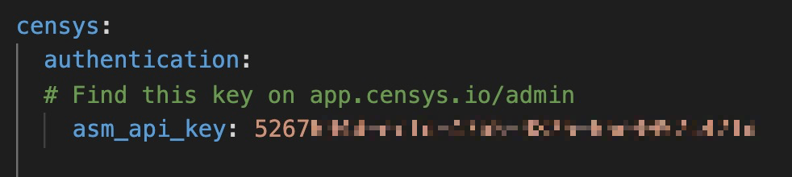
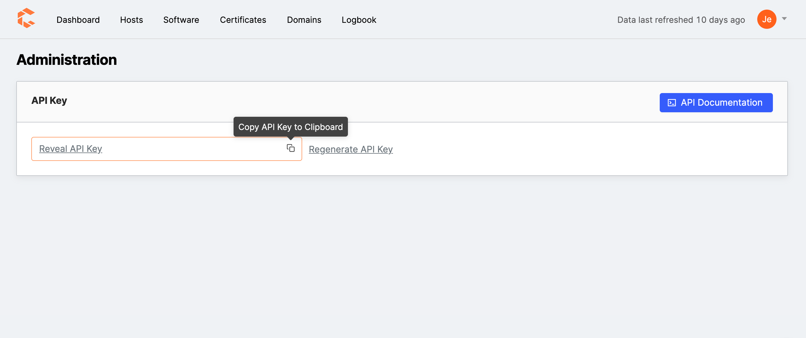
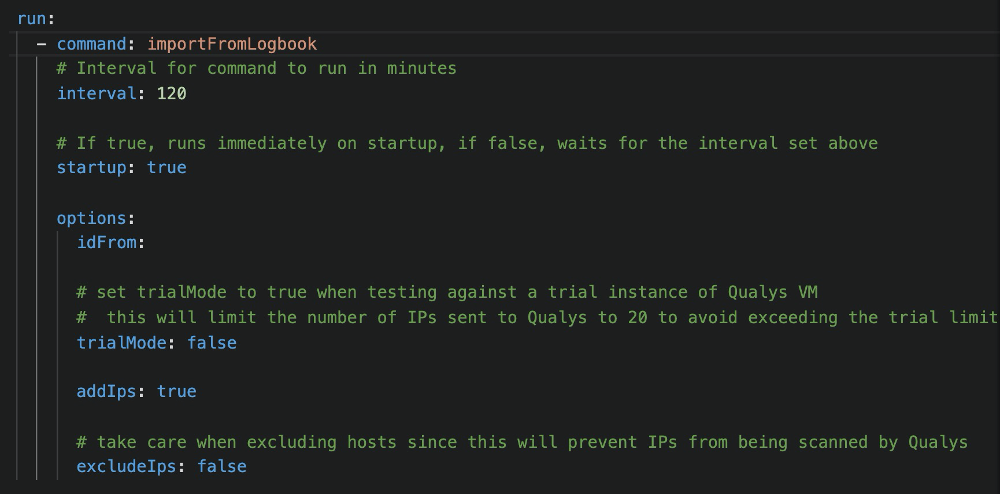
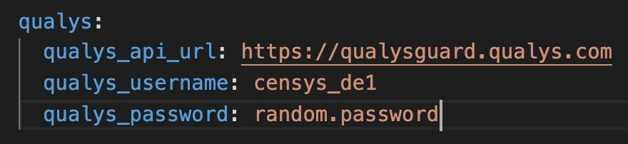
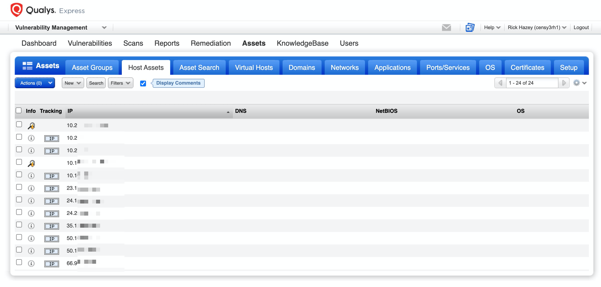

# Censys Qualys Integration
v1.0, 2021-02-08
:toc: preamble
:toc-title: In this guide:

The Censys Qualys integration sits between the Censys Attack Surface Management platform and your Qualys instance.

The integration queries the Censys ASM platform's logbook API and feeds newly found hosts into Qualys' vulnerability management tool. It also provides a list of hosts that are no longer found to be part of an organization's attack surface, which can be used to exclude IPs from the Qualys Vulnerability Management scanner.

## Installation Considerations

The Censys Qualys integration is packaged to run in a Docker container, which can be deployed on a variety of infrastructure types. Container management is at the discretion of the user. 

This integrations works with the Qualys https://www.qualys.com/apps/vulnerability-management-detection-response/[VMDR tool].

## Set up the Censys Qualys Integration

To set up the Censys integration, you must:

. Create a settings.yaml file in the repo
. Build the docker container
. Run the application

### Create a settings file

To create the settings file, open the `settings_example.yaml` file in the repo and fill in the fields with the required information:

#### Authentication

In the `authentication` section, provide a value for the `asm_api_key` field by pasting your API key.

.Censys ASM platform authentication information

To obtain your key, visit the link:https://app.censys.io/admin[admin page] in the Censy ASM app and copy it.

.Censys ASM platform app admin page

#### Run

In the `run` section of the settings file, provide values for the following fields:

* `interval` - An interval for the command in minutes. Default is 120.

* `startup` - A boolean for whether to run the command immediately on startup (`true`) or wait the interval prescribed in `interval` (`false`).

**Other Options**

* `idFrom` - The Censys logbook event ID to begin pulling events from at startup. Logbook event IDs increase sequentially from 1. If empty, all events will be pulled on initial startup.

* `trialMode` - A boolean for whether to restrict the number of hosts to 20 so as not to exceed the Qualys trail limit.

* `addHosts` - A boolean for whether to add hosts to your Qualys VM scanning queue that Censys has associated to your attack surface.

* `excludeHosts` - A boolean for whether to exclude hosts from VM scanning that Censys has disassociated from your attack surface.

.Censys ASM platform run information

#### Qualys

In the `qualys` section, provide values for the following fields:

* `qualys_api_url`: The API URL for your Qualys https://www.qualys.com/platform-identification/[platform].

* `qualys_username`: Your Qualys username.

* `qualys_password`: Your Qualys password.

.Qualys information

#### Save Your File

After you've provided values for all the fields in `settings_example.yaml`, save the file as `settings.yaml`.

### Build the docker container

Run the following command on your terminal:

....
./censys-qualys.sh build
....

### Run the docker container

Run the following command:

....
./censys-qualys.sh run
....

If you want to test the integration with a single run, use the following command:

....
./censys-qualys.sh once
....

## Results in Qualys

After the integration begins sending Censys logbook events to Qualys, hosts discovered by Censys will be fed into Qualys' vulnerability management system for scanning and monitoring.

.View hosts in Qualys
